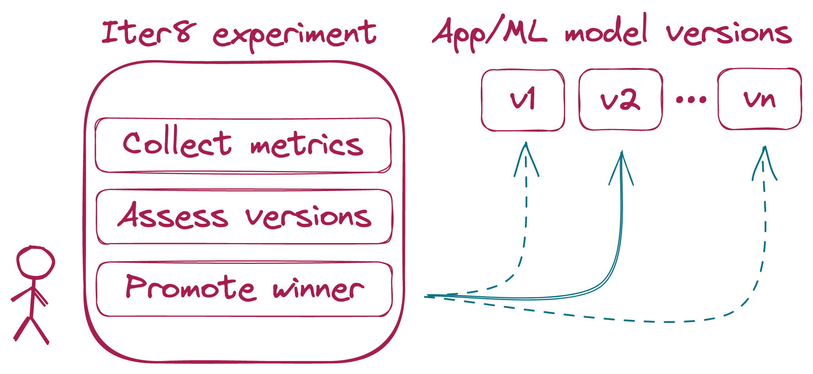
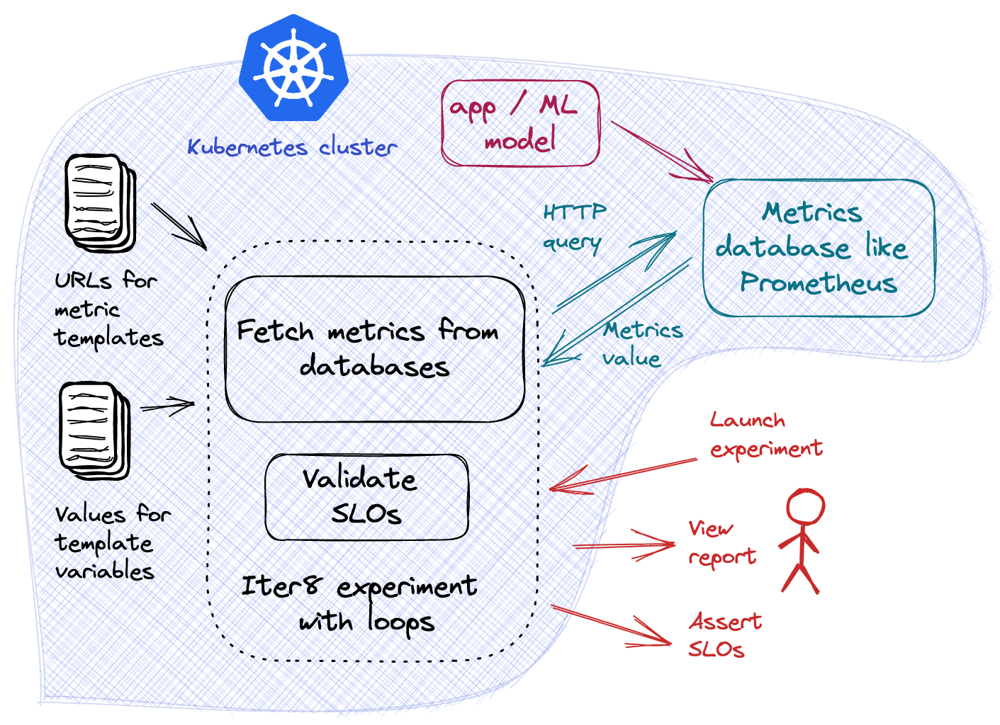

# Performance testing with Iter8, now with custom metrics!




**SLO validation** and **A/B(/n) testing** are key to ensuring your services **perform as intended** and **maximize business value**. With [Iter8](https://iter8.tools/0.10/), you can get started with SLO validation and A/B/(/n) testing in seconds. 

[Iter8](https://iter8.tools/0.10/) is an open source metrics-driven release optimizer for apps and ML-models deployed with Kubernetes. You can use Iter8 to conduct various kinds of **experiments** that do a **variety of tasks** such as collecting metrics from different versions of your service, validating those metrics against SLOs, determining which is the best performing version, and much more.

For simple [HTTP](https://iter8.tools/0.10/tutorials/load-test-http/basicusage/#specify-metrics-and-slos) and [gRPC](https://iter8.tools/0.10/tutorials/load-test-grpc/basicusage/#specify-metrics-and-slos) services, you can use Iter8's built-in metrics, which will automatically generate load and collect **latency** and **error-related** metrics. However, if you want to use metrics from external sources, you can define **custom metrics**, which tells Iter8 how to query for metrics from those sources. 

For example, if your service is using Istio, then Istio is also collecting performance metrics for your service and storing them in a Prometheus database, and if you would like to use those metrics in your Iter8 experiments, then you can use custom metrics to do so. 

Other service meshes like OpenShift and Linkerd also store performance metrics in Prometheus, which can all be utilized by Iter8 with custom metrics. However, Iter8 and custom metrics are not limited to just service meshes and Prometheus databases. For example, Knative, a tool for building serverless applications, and KServe and Seldon, tools for ML applications, all provide their own ways for collecting metrics and Iter8 can utilize all of these via custom metrics. 

*Custom metrics is a **general solution** that allows Iter8 to work with any service mesh, application resource, and any database which serves metrics*.

In this tutorial, we will show you how custom metrics are defined, using Istio and Prometheus as an example. Iter8 does provide custom metrics for some tools but knowing how to define custom metrics can allow you to use Iter8 to its maximum potential. 

# All about custom metrics files

### What's in a metrics file?

A custom metrics file describes how to query your metrics provider via HTTP and contains a set of queries for each metric. In addition to the set of queries, it also contains a set of jq expressions for extracting the metric value from the JSON response from each respective query.

A custom metrics template is used to define the desired metrics in a Iter8 consumable fashion. It is templated so you can easily provide service-specific parameters so Iter8 can query for the correct service.

We will now describe what is in the [Istio custom metrics template](https://github.com/iter8-tools/iter8/blob/master/custommetrics/istio-prom.tpl) that Iter8 provides.

Here is an excerpt:

```yaml
url: {{ default .istioPromURL "http://prometheus.istio-system:9090/api/v1/query" }}
provider: istio-prom
method: GET
metrics:
- name: request-count
  type: counter
  description: |
    Number of requests
  params:
  - name: query
    value: |
      sum(last_over_time(istio_requests_total{
        {{ template "istio-prom-dest" . }}
      }[{{ .elapsedTimeSeconds }}s])) or on() vector(0)
  jqExpression: .data.result[0].value[1] | tonumber
```

`url` is the **HTTP endpoint** of the metrics provider that we want Iter8 to send queries to. In this case, this should be Prometheus database endpoint. With the default installation of the [Prometheus add-on](https://istio.io/latest/docs/ops/integrations/prometheus/), the Prometheus service will be under the `istio-system` namespace and be accessible on port `9090`. Therefore, we have also configured a default value.

`provider` is a **name** for the metrics provider, the source of the data. The provider name should match the name of the custom metrics file and is used to identify the file and generate names for some other files. For example, this custom metrics template `istio-prom.tpl` will generate a custom metrics YAML `istio-prom.yaml` when the experiment is launched.

`method` is the **HTTP method** that that should be used for the query. Prometheus allows the user to query using both `GET` and `POST` ([source](https://prometheus.io/docs/prometheus/latest/querying/api/)) so we have selected to use `GET`.

`metrics` is a set of individual **queries** and **jq expressions** for each metric. In this tutorial, we will only describe one metric, `request-count` but you can add as many metrics as needed.

`metrics[0].name` is the **name** of the metric. In this case, it is `request-count`.

`metrics[0].type` is the [type](https://prometheus.io/docs/concepts/metric_types/) of the metric. The type should either be `counter` or `gauge`.

`metrics[0].description` is a **description** of the metric. `request-count` should be the number of requests sent to the destination service.

`metrics[0].params` is the set of **HTTP parameters** that should be sent with the query. Prometheus requires one query parameter, `query`, which we have defined ([source](https://prometheus.io/docs/prometheus/latest/querying/api/#expression-queries)). Prometheus can also use `time` and `timeout` query parameters but they are optional, so we did not define them.

`metrics[0].params[0].name` is the name of the HTTP parameter, in this case `query`.

`metrics[0].params[0].value` is the [PromQL query](https://prometheus.io/docs/prometheus/latest/querying/basics/) that should be sent for `request-count`. Note that there is additional templating here, the purpose of which is to select metrics for a particular destination service.

Finally, `metrics[0].params[0].jqExpression` is the [jq expression](https://stedolan.github.io/jq/manual/) that should be applied to the query response in order to extract the metrics value.

### Using a custom metrics file



To use custom metrics in your experiment, use the `custommetrics` task.

Consider the following experiment.

```shell
iter8 k launch \
--set "tasks={custommetrics,assess}" \
--set custommetrics.templates.istio-prom="https://raw.githubusercontent.com/iter8-tools/iter8/master/custommetrics/istio-prom.tpl" \
--set custommetrics.values.destinationWorkload=httpbin \
--set custommetrics.values.destinationWorkloadNamespace=default \
--set assess.SLOs.upper.istio-prom/error-rate=0 \
--set assess.SLOs.upper.istio-prom/latency-mean=100 \
--set runner=cronjob \
--set cronjobSchedule="*/1 * * * *"
```

`tasks={custommetrics,assess}` tells Iter8 to use the `custommetrics` and the `assess` tasks. The `custommetrics` task uses your custom metrics file in order to query for metrics and the `assess` task will use those metrics to evaluate your service(s) by validating them against the specified SLOs.

`custommetrics.templates.istio-prom=...` tells Iter8 where it can access the custom metrics file.

`custommetrics.values....=...` these are related to the additional templating that was mentioned in the section on `metrics[0].params[0].value`. This allows a particular destination service to be selected, in this case, one with `destinationWorkload=httpbin` and `destinationWorkloadNamespace=default`.

`assess.SLOs....=...` are related to the selecting SLOs to validate in the `assess` task. In this case, Iter8 will check that error rate and mean latency, collected from the `custommetrics` task, are 0 and below 100 ms respectively.

Lastly, `runner=cronjob` tells Iter8 to use a cronjob for this experiment. This is what's known as a looping experiment, where the tasks of the experiment are run on a schedule. This is useful for experiments that should be run over a long period of time, such as with live traffic. `cronjobSchedule="*/1 * * * *"` defines how often the cronjob should run.

*** 

If you would like to try the previous experiment, you can do so with the following steps.

  1. Create a new Kubernetes cluster.
  2. [Install Istio](https://istio.io/latest/docs/setup/install/).
  3. [Install Istio's Prometheus add-on](https://istio.io/latest/docs/ops/integrations/prometheus/).
  4. [Enable automatic Istio sidecar injection](https://istio.io/latest/docs/setup/additional-setup/sidecar-injection/) for the `default` namespace. This ensures that the pods created in steps 5 and 6 will have the Istio sidecar.
  ```shell
  kubectl label namespace default istio-injection=enabled --overwrite
  ```
  5. Deploy the sample HTTP service in the Kubernetes cluster.
  ```shell
  kubectl create deploy httpbin --image=kennethreitz/httpbin --port=80
  kubectl expose deploy httpbin --port=80
  ```
  6. Generate load.
  ```shell
  kubectl run fortio --image=fortio/fortio --command -- fortio load -t 6000s http://httpbin.default/get
  ```
  7. Launch the Iter8 experiment
  ```shell
  iter8 k launch \
  --set runner=cronjob \
  --set cronjobSchedule="*/1 * * * *"
  --set "tasks={custommetrics,assess}" \
  --set custommetrics.templates.istio-prom="https://raw.githubusercontent.com/iter8-tools/iter8/master/custommetrics/istio-prom.tpl" \
  --set custommetrics.values.destinationWorkload=httpbin \
  --set custommetrics.values.destinationWorkloadNamespace=default \
  --set assess.SLOs.upper.istio-prom/error-rate=0 \
  --set assess.SLOs.upper.istio-prom/latency-mean=100 \
  ```

In order to see the status of the experiment, run the following command...
```shell
iter8 k report
```

... and then you should see something similar to the following!
```
Experiment summary:
*******************

  Experiment completed: false
  No task failures: true
  Total number of tasks: 2
  Number of completed tasks: 6

Whether or not service level objectives (SLOs) are satisfied:
*************************************************************

  SLO Conditions        |Satisfied
  --------------        |---------
  istio/error-rate <= 0 |true
  istio/latency-mean <= 100 |true


Latest observed values for metrics:
***********************************

  Metric                           |value
  -------                          |-----
  istio/error-count                |0.00
  istio/error-rate                 |0.00
  istio/latency-mean               |6.31
  istio/le500ms-latency-percentile |1.00
  istio/request-count              |2110.00
```

This is a summary of what happened during the experiment. At this point in the experiment (recall that this is a looping experiment where the tasks are run on a schedule), the error rate and the mean latency are below the maximum that we have set. Note that `error-count` and `latency-mean` as well as `error-rate`, `le500ms-latency-percentile`, and `request-count` are all metrics collected from Istio using custom metrics.

### Next steps

To learn more about Iter8 and how to run SLO validation and A/B(/n) experiments with your apps and ML models, take a look at our website [iter8.tools](https://iter8.tools). We have many [tutorials](https://iter8.tools/0.10/tutorials/load-test-http/basicusage/) as well as [documentation](https://iter8.tools/0.10/user-guide/topics/values/). If you need any help, you can find us on [Slack](https://join.slack.com/t/iter8-tools/shared_invite/zt-awl2se8i-L0pZCpuHntpPejxzLicbmw) and we'll happily answer any questions you have.